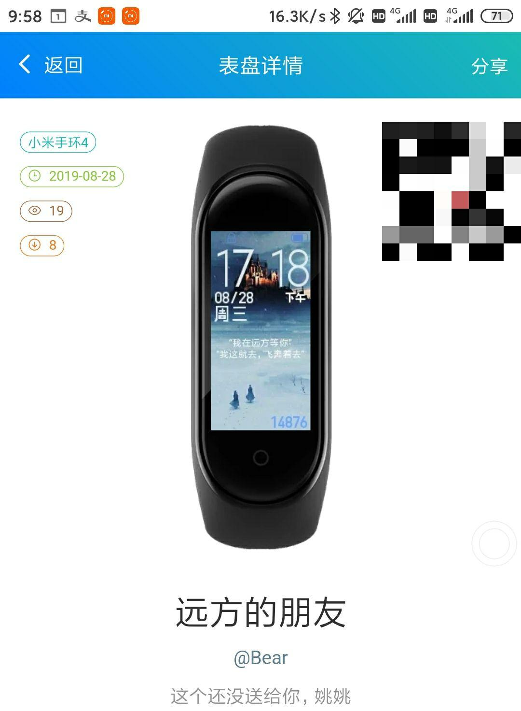

没有接触高端(高价)产品，只用过小米手环2和小米手环4nfc。

其中2是在高中时购买，因为宿舍生活，主要用到震动闹钟和电子表的功能，计步也就图个有趣。

而4刚购买两个多月，给我留下深刻印象的功能:

1.支付功能

学校食堂的收费可以用饭卡可以扫码，包括一部分开通扫码支付的店面，就算手机没电也没关系(现金早就不带了)。公交地铁出行也算在这里。

2.天气和通知

不用拿起手机也能得到很多生活信息，快递短信啊，通知啊，天气啊等等，可以自己选择通知应用，换一个说法就是订阅自己感兴趣的短消息，一定程度上减轻了手机依赖。

3.运动功能

对于我这个懒蛋来说就是“哇，这也能测，(改天——划掉——月——划掉)，明年吧。”

我没发言权?

4.查找手机

经常用，在一定范围发出响声，可用于防盗和粗心——主要粗心。?

5.非官方DIY(该功能在小米运动4.0.8被禁用)

在第三方软件的帮助下可以做静态或动态表盘，可以用一些有纪念意义的图片，like this

官方在4.0.8版本中推出自定义功能，暂时很简陋，倒是足够用和简单易用。

6.文字版小爱同学

听说对智能设备(小米生态)的控制比较方便，木得钱木有发言权，对于我来说可有可无。

**总结一下**

肯定是有用的，一方面替代手表，一方面运动监测，当然每人都有自己的习惯，对我我自己来说挺有用。

其次兼具实用性娱乐性，带来了不少生活便利和乐趣。

最后是一些思考，智能手环是科技改变生活中的细细一缕，未来的手环可能会越来越美观，集成度越来越高，逐渐脱离简单朴素，我想象一下，也许会结合投影和华为的LiteOS技术，再加上5g的传输，真正的掌上电脑或许就是这样，当然了这需要电池的技术大进步，只是不知道这个东西的出现时间是否恰当，又或者有其他恰当的东西出现。跑题跑远了，其实吧，我只是想说，未来一步步出现在眼前真的是一件很有意思的事情，正所谓：做一个亲历未来的人。(我自己说的?)

**_本文首发于知乎，收录于个人博客_**

**_bear962464.cn_**

某算法图解app分享：

http://bear962464.cn/2019/09/07/386/
