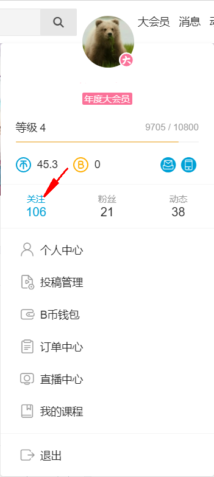

## 安装链接

[点击这里直达greasyfork](https://greasyfork.org/zh-CN/scripts/399760-bilibili%E8%87%AA%E5%8A%A8%E5%8F%96%E5%85%B3 "点击这里直达greasyfork")

## 简介

**这是一个B站的自动取关脚本**

## 原理

**计时器自动刷新,并在本页面的关注列表点击取消关注**

## 启动页面

### 方法一

\*_[https://space.bilibili.com/](https://space.bilibili.com/)_/fans/follow\*\*

`*为你的B站UID`

### 方法二

**也可通过首页>关注按钮进入**

## 使用

**刷新速度越快可以填写越小的数字,随便填,不管用再增加**
