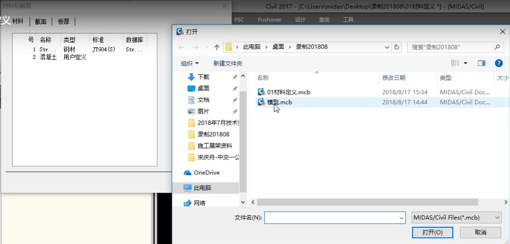

## Midas学习笔记

### **目录**

\[TOC\]

### 程序界面

#### 横向菜单

  

1. 常用单位系
2. MCT命令流
3. SCP截面特性计算器

* * *

#### 竖向菜单

 树形菜单-工作：建立模型的每一步操作 可能用到 定义组   用户自定义-左右两个树形菜单，作用：边操作边检查

* * *

 信息窗口：方便查看操作和错误信息

* * *

可以查看结构，荷载。右上角视角。 

* * *

方便实用小菜单 常用的激活（F2）和钝化（ctrl+F2） 

* * *

### 材料定义

 **材料特性值就是定义材料** **材料定义有三种方法**

#### 方法一：程序includes

 **演示**  点击**适用**后按序号显示在左侧窗口

#### 方法二：用户自定义

 **演示** 

#### 方法三：导入现有模型里的材料

 **演示** 导入——.mcb——打开——选择材料（留需要的在右侧）——编号方式 

#### 结果可视

### 截面定义

 

也是有多种方法

#### 内嵌数据库

内嵌数据库的截面定义   演示  截面特性值  点击适用

#### 用户定义

 演示 

#### 数值

更关心截面特性值  演示  点击计算——计算结果可更改——输入名称——适用

#### 导入已有模型

文件类型.mcb 不需要的放左边 

#### 另：编辑可修改偏心

### 定义节点定义

| **横栏节点单元** 需要的截图过多，还是看视频吧 最简单的是输入每个节点坐标 较方便的是通过Excel | x | y | z |
| --- | --- | --- | --- |
| 0.09 | 0 | 0 |
| 0.795 | 0 | 0 |

然后点击**节点表格** [具体的操作和其他的方法还是看视频吧](https://www.bilibili.com/video/av47639045?p=6) 还有一个重排节点序号

### 建立单元

 单元可以是点线面  可以复制，扩展，分割，镜像（方向xyz，长度就是间距） 对于镜像的单元通过 /修改参数/统一单元坐标轴，参考原单元，xyz 进行方向的统一

导入CAD的.dxf文件生成相应的单元（导入前统一单位） 选择需要的图层导入 点击适用  

### 定义边界

#### 解释

 单个节点约束——前三栏 两个节点连接——弹性刚性 梁两端释放条件——释放/偏心栏目的释放梁端约束，比如铰接滑动滚动

#### 具体演示

1. 一般支撑 三个平动三个转动一个Rw单梁其自由度，选中节点，勾选进行约束自由度（默认参考整体坐标轴） 
2. 节点弹性支撑 类似1，不同在可自行输入弹簧刚度值（自行计算），也可打钩 
3. 节点之间 弹性连接 三个平动三个转动 6个约束分量，或直接类型刚性（按照单元坐标系，注意方向） 设置好后选点 刚性连接:选择主节点——设置自由度（or类型）——定义从属节点（善用小菜单栏）  
4. 杆端  铰接滑动滚动 勾选要定义的约束分量（相对值和数值）——选择杆件 相对值和数值：传递出去的抗弯刚度为百分比还是定值 比如My=1为完全连接，=0为铰接 
    
    ### 定义荷载
    
    分为两步：
    
    #### 第一步 静力荷载工况
    
    名称类型   
    
    #### 第二步 给荷载赋予内容
    
    1.节点荷载   选择要定义的节点，给分量赋值（按照整体坐标系） 2.单元荷载    单元荷载——工况名称——荷载类型——选择单元——数值 相对值——相对于整体的？%位置受到P的？力 均布荷载添加后  3.面荷载 和2大同小异，注意选择对应的单元类型   演示结果 
    
    ### 定义自重
    
    civil是通过截面面积、材料容重、单元构建的长度和自重系数四个参数计算自重的 定义自重荷载工况——添加自重——输入自重系数（如Z：-1）——点击添加——结果     当自重作用时考虑结构的容重与材料定义时的容重不同，输入自重容重/材料容重。 比如素混凝土25，自重容重钢筋混凝土26，输入-26/25，点击添加。修改用编辑 
    
    ### 定义移动荷载
    
    四个步骤 
    
    #### 选择规范
    
    China 
    
    #### 定义车道
    
    ##### 车道线——线单元模型
    
    偏心距——车轮间距——桥跨（冲击）——车辆移动方向——通过 两点or鼠标点取or单元号 选车道线 偏心距：车道线和建模线的差距，没有为0 对于连续梁，输入最大跨的长   
    
    ##### 车道面——板单元模型
    
    和线单元大同小异   
    
    #### 定义移动荷载
    
    标准车辆（规范） 用户自定  
    
    #### 定义移动荷载工况
    
    目的：移动荷载——》车道  
