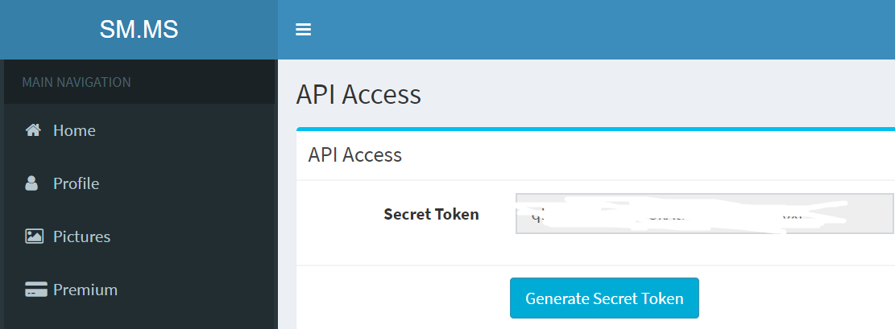
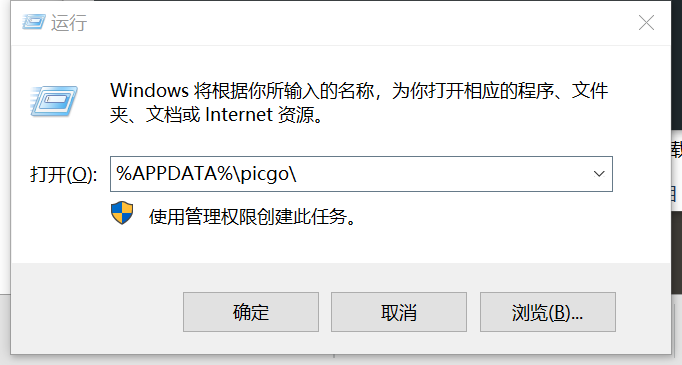
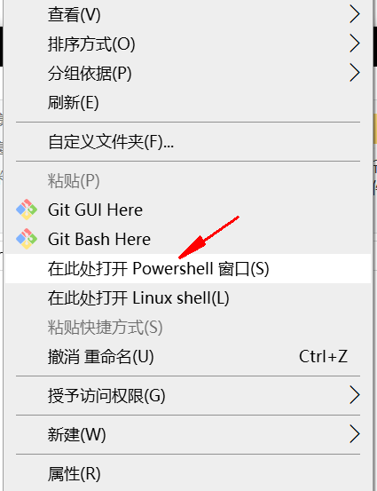
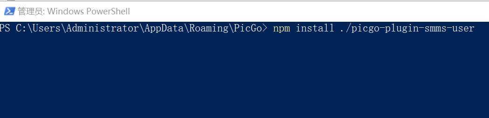

#### 环境

> 1. [picgo](https://github.com/Molunerfinn/PicGo/releases)
> 2. [nodejs](https://nodejs.org/zh-cn/)

#### 流程

1. [smms](https://sm.ms/home/apitoken)生成一个token  复制下来
2. clone插件[picgo-plugin-smms-user](https://github.com/xlzy520/picgo-plugin-smms-user)放入 
    
    ```
    %APPDATA%\picgo\ 
    //在该目录shift+右键
    ```
    
    
    
    ```
    npm install ./picgo-plugin-smms-user
    //回车
    ```
    
    
    
    #### 最后
    
    > 重启picgo,图床/SM.MS-登录用户输入token
    

如果有不明白欢迎留言或查询官方文档 本文使用的就是smms图床，速度应该还可以
