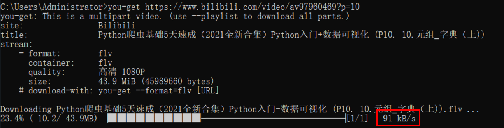
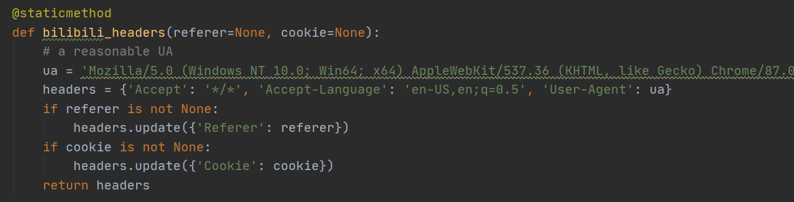
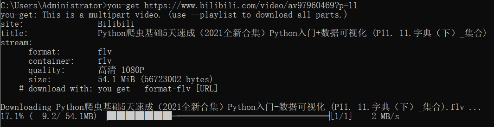

# 解决you-get下载视频缓慢的问题

[](http://bear962464.cn)

## 前言

you-get是一款非常强大的程序，可以下载大量网站的视频，如果感兴趣请访问[开源地址](https://github.com/soimort/you-get)

在使用过程中我遇到了一个问题：下载视频被限速，速度不超过1Mbs甚至只有50kb/s，面对漫长的下载时间不免等的心烦。

## 思考

下载视频为什么被限速？我想也许这是官方在网站访问高峰时间限制爬虫爬取视频来保证真实用户的观看体验。

那官方是如何来识别是否是爬虫呢？通过访问的逻辑么？还是某种固定的UA？感觉不太可能是访问逻辑，you-get本身就是模仿用户缓存视频，如果按照逻辑，那可能会产生大量的“误封”。

那这些“机器用户”还有什么共同特征呢？对，UA，即User-Agent。

因为用户们都在用着同一款you-get的发行版本，python源码是固定的，内部UA部分也是固定的。

所以来不妨来尝试一下修改UA是否能加快下载速度。当然了，如果是限制的IP那就只能重启路由更换地址咯

## 环境

| 名称 | 版本 |
| --- | --- |
| Python | 3.8.1 |
| you-get | 0.4.1500 |
| 系统 | win10 |

linux发行版的步骤应该也是一样的

## 尝试修改User-Agent

### 对照

在尝试修改UA之前，先测试一下现在的下载速度



好的，现在是91kb/s

### 寻找you-get路径

```python
pip show you-get
'''
C:\Users\Administrator>pip show you-get
Name: you-get
Version: 0.4.1500
Summary: Dumb downloader that scrapes the web
Home-page: https://you-get.org/
Author: Mort Yao
Author-email: mort.yao@gmail.com
License: MIT
Location: c:\users\administrator\appdata\local\programs\python\python38\lib\site-packages
Requires:
Required-by:
'''
```

好的，我们得到了路径

Location: c:\\users\\administrator\\appdata\\local\\programs\\python\\python38\\lib\\site-packages

### 寻找对应的UA配置

打开该目录下的**./you\_get/extractors**文件夹

可以找到bilibili的对应文件**bilibili.py**

随便什么编辑器打开

很容易的找到UA在line55处,貌似大会员cookie可以填写在这里啊，当然这是另一个话题了



### 更换UA

注释掉原有配置，再按照格式加入新的UA，我这里是取用的Edge真实UA，网络搜索也是一搜一大把，保存后是这样的

```python
@staticmethod
    def bilibili_headers(referer=None, cookie=None):
        # a reasonable UA
        ua = 'Mozilla/5.0 (Windows NT 10.0; Win64; x64) AppleWebKit/537.36 (KHTML, like Gecko) Chrome/87.0.4280.88 Safari/537.36 Edg/87.0.664.66'
        headers = {'Accept': '*/*', 'Accept-Language': 'en-US,en;q=0.5', 'User-Agent': ua}
        if referer is not None:
            headers.update({'Referer': referer})
        if cookie is not None:
            headers.update({'Cookie': cookie})
        return headers
```

### 再次测速



成功，速度已然恢复正常

## 总结

- pip show you-get
- edit ./you\_get/extractors/bilibili.py
- Change 'User-Agent'
- Success！

## 感想

没有基础

半蒙半做

巧合成功

日后加油
