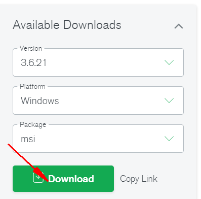
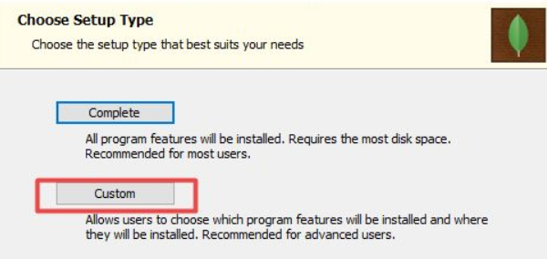
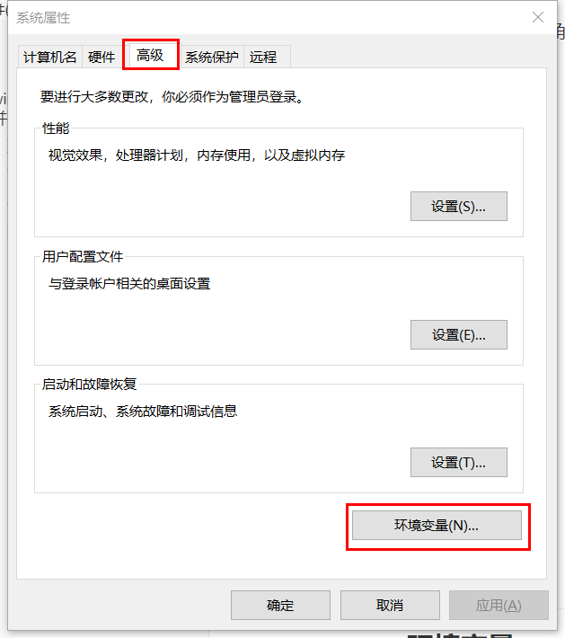
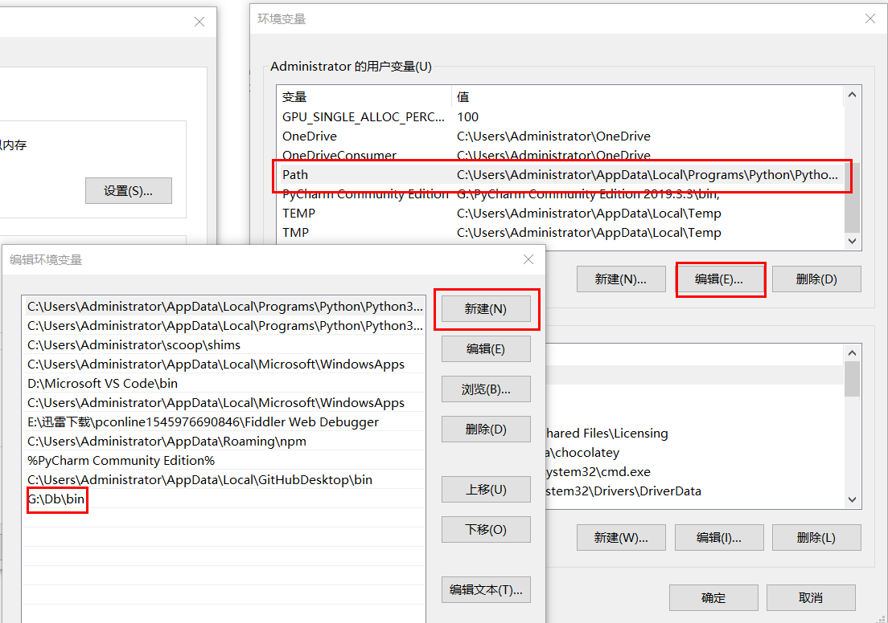

## 环境

win10 x64

## 下载

免费的[**社区版**](https://www.mongodb.com/try/download/community)

进入后在右侧选择版本

我使用的是3.6，点击下载（如果跳出登录可以谷歌登录或任意填写）



## 安装

双击安装包

- 在这个页面选择custom自定义安装
    
    
    
- 取消勾选右下角的**Install MongoDB Compass**
    
    
    

## 配置环境

### 环境变量

- win+r快捷键呼出运行，输入sysdm.cpl回车
- 高级选项卡，右下角环境变量



- 编辑path ，新建>输入自定义的MongoDB安装路径下bin文件夹，最后全部确定



### 新建数据目录

1. win+r，cmd回车打开命令行,依次运行下面命令
    
2. 第一行为位置，第二行为创建的文件夹，自行更改
    
    ```
    cd g:\
    md "\data\db"
    ```
    
3. 完成后输入以下命令运行server
    
    ```
    mongod --dbpath g:\data\db
    ```
    
4. 没有出现以下信息且没有自动退出即为成功
    
    ```
    [initandlisten] *** immediate exit due to unhandled exception
    ```
    
5. 服务端口和pid等信息在输出的初始位置
    
    ```
    starting : pid=16152 port=27017 dbpath=g:\data\db 64-bit host=XXXX
    ```
    

## 基本使用

### 运行mongod server

命令行运行

```
mongod --dbpath g:\data\db
```

### 操作数据库

版本3.6安装完成之后默认不需要用户名与密码

所以另外打开一个命令行后直接输入

```
mongod
```

即可对数据库进行操作，具体操作请另行搜索

### 几个mogodb基本命令

| 命令 | 作用 |
| --- | --- |
| show dbs | \----列出所有数据库 |
| db.getName() | \----列出当前数据库名 |
| use dbname | \----切换到某个数据库 |
| db.createUser() | \----创建用户角色 |
| db.auth() | \---- 验证用户到数据库 |
