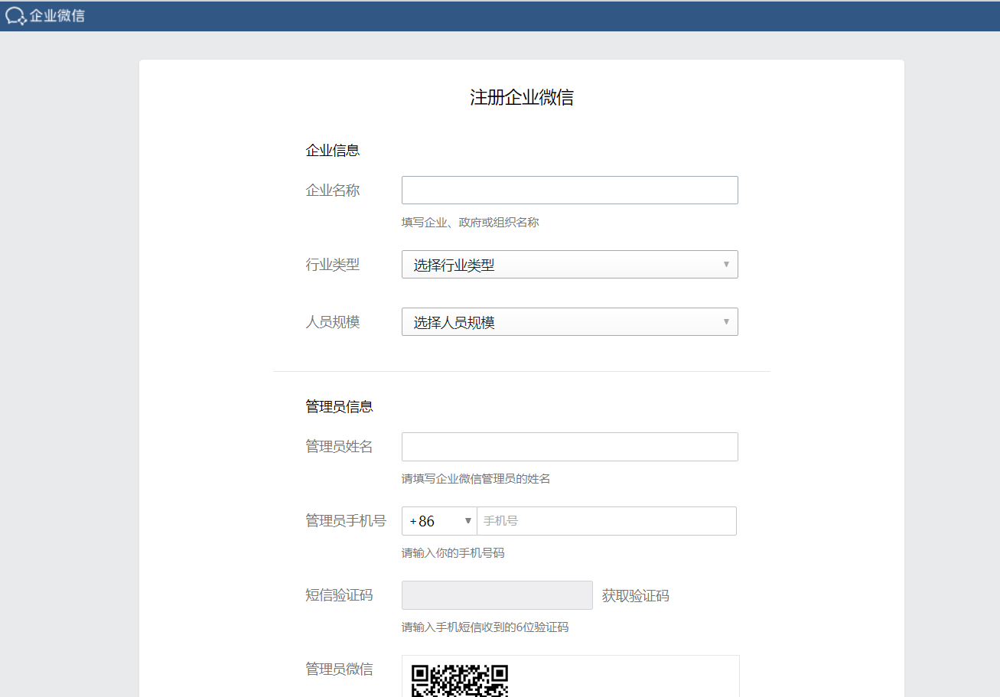
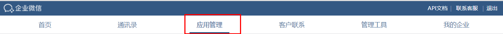
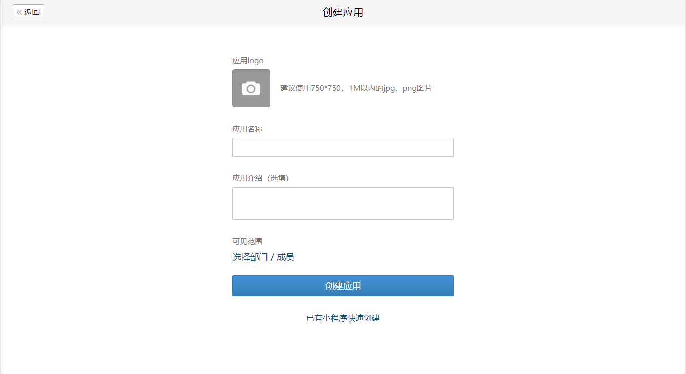
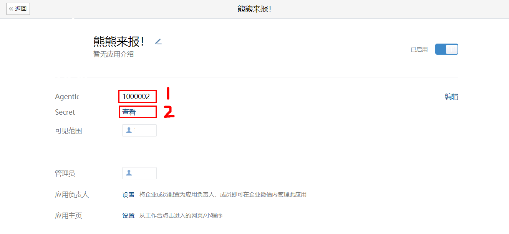
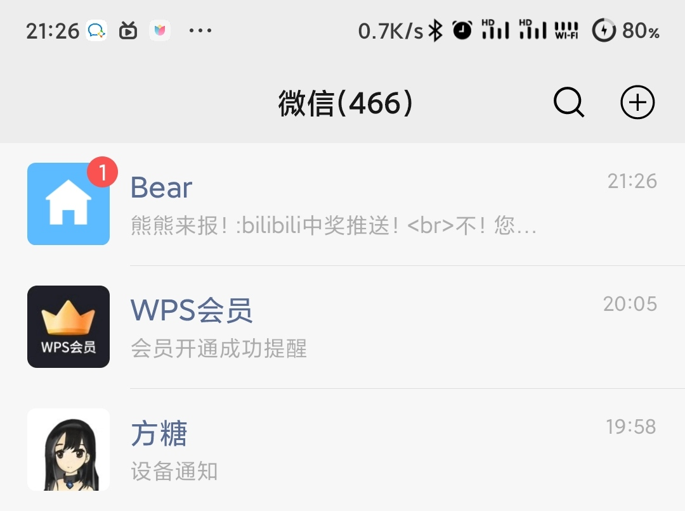

# 这文章干嘛的

使用企业微信应用推送通知

推送到微信或企业微信，速度很快

# 需要什么操作

- 注册微信企业版
- web页面创建应用
- 获取三个参数
- 一个函数

## 1、注册

注册微信企业版用个人微信就可以，不需要认证 链接：[企业微信注册 (qq.com)](https://work.weixin.qq.com/wework_admin/register_wx?from=loginpage)



## 2、创建

在登陆后就可以创建应用了

应用管理 -> 自建 -> 创建应用，随便创建，可见范围可以只选择自己，也可以选择部门





## 3、参数

这三个参数依次是：

- corpid
    
- corpsecret
    
- agentid
    

如图 **1处为agentid**，**2处为corpsecret**，点击查看后需要在手机“**企业微信**”app内查看

**corpid**指的是**企业ID**，在 我的企业 -> 翻到最下边 查看



## 4、函数

调用函数给自己的微信发送通知，**注意**"agentid"写死了1000002，有需要请自行修改

以下只是一个示例，环境node.js，**变量仅供示例无法使用**

```javascript
const corpsecret = "PgTp1JcsdLUP8jCsghyr3YHEnasgdaff6f3te3sfQ"
const corpid = "wwra38952f94e286ra"

function wx(msg) {
    return new Promise(async (resolve) => {
        try {
            if (corpid && corpsecret) {
                let url = `https://qyapi.weixin.qq.com/cgi-bin/gettoken?corpid=${corpid}&corpsecret=${corpsecret}`
                let res = await axios.get(url)
                access_token = res.data.access_token
                let turl = `https://qyapi.weixin.qq.com/cgi-bin/message/send?access_token=${access_token}`
                let data = {
                    "touser": "@all",
                    "msgtype": "text",
                    "agentid": 1000002,
                    "text": {
                        "content": msg
                    },
                    "safe": 0
                }
                let tres = await axios.post(turl, data)
                if (tres.data.errcode == 0) {
                    console.log("企业微信:发送成功");
                } else {
                    console.log("企业微信:发送失败");
                    console.log(tres.data.errmsg);
                }
            } else {
                console.log("企业微信:你还没有填写corpsecret和corpid呢，推送个鸡腿");
            }
        } catch (err) {
            console.log("企业微信：发送接口调用失败");
            console.log(err);
        }
        resolve();
    });
}
```

第二个示例（python）

```python
# -*- codeing = utf-8 -*-
# @Time : 2021/5/29 17:07
# @Author : 96bearli
# @File : vxpush.py
# @Software : PyCharm
import requests
import json

corpId = ""  # 企业id
agentId = ""  # 应用id
secret = ""  # 应用secret

def vx(msg):
    try:
        if corpId and secret and agentId:
            url = 'https://qyapi.weixin.qq.com/cgi-bin/gettoken?corpid=' + corpId + '&corpsecret=' + secret
            res = requests.get(url=url)
            jsonData = json.loads(res.text)
            if jsonData["errmsg"] != "ok":
                print("errcode:", jsonData["errcode"], "\n企业微信推送失败")
                return 0
            token = jsonData['access_token']
            t_url = 'https://qyapi.weixin.qq.com/cgi-bin/message/send?access_token=' + token
            data = {
                "touser": "@all",
                "msgtype": "text",
                "agentid": agentId,
                "text": {
                    "content": msg
                },
                "safe": 0
            }
            send_data = (bytes(json.dumps(data), 'utf-8'))  # 没这一步返回40008
            t_res = requests.post(url=t_url, data=send_data)
            t_res_json = json.loads(t_res.text)
            print("推送返回信息：" + t_res.text)
            if t_res_json["errmsg"] == "ok":
                print("企业微信推送成功")
            else:
                print("企业微信推送失败")
        else:
            print("请填全企业id等参数")
            return 0
    except Exception as error:
        print(error)
        print("请检查参数正误或网络畅通")

if __name__ == '__main__':
    vx("test")
```

# 其他

## 微信推送

在以上操作完毕后只能在企业微信app内收到推送，所以需要使用微信插件

位置：我的企业 -> 微信插件 -> 邀请关注

微信扫描二维码，之后推送就能到微信了


