[](https://bear962464.cn)

[学习视频链接(bilibli)](https://www.bilibili.com/video/av97960469) [源码仓库(github)](https://github.com/96bearli/DoubanMovieTop250)

## 要学习的内容

- python的基础
    
- 网络爬虫的技术实现
    
- 通过框架 组件等数据可视化的技术应用
    

# python基础知识

## 认识python

解释型（用的不是编译器，十解释器），面向对象的高级编程语言

开源 交互 跨平台移植

最开始由C语言实现

python2 python3 不兼容

火是因为应用场景广

易于使用，简单优雅

运行速度慢（相对于C）原因在于解释型语言 边解释为机器码一边执行，适用于小项目

代码不能加密

应用场景广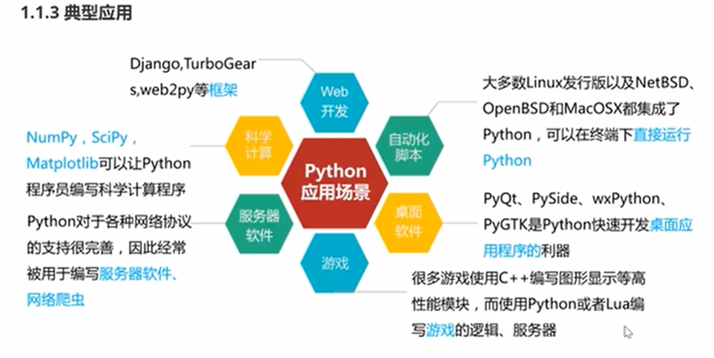

应用方向

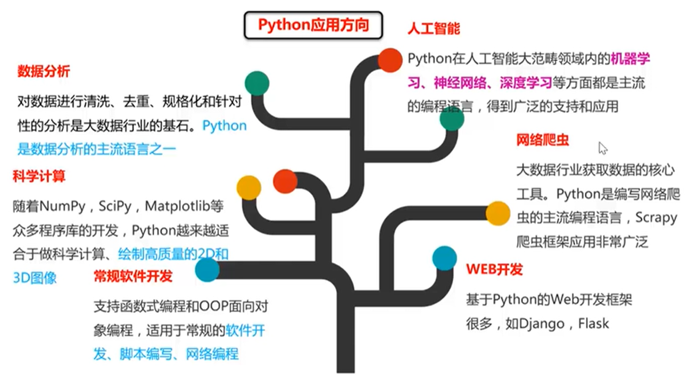

## 环境

python3 windows要设置路径

ide是pycharm

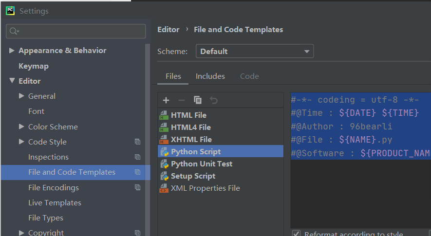

```shell
#-*- codeing = utf-8 -*-
#@Time : ${DATE} ${TIME}
#@Author : 96bearli
#@File : ${NAME}.py
#@Software : ${PRODUCT_NAME}
```

## 变量

### 变量的规定

- 变量可以是**任意的数据类型**
    
- 变量名必须是**大小写英文，数字和下划线\_**的组合，且**不能数字开头**
    
- 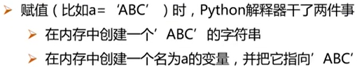
    
    ```python
    a=1   #整数
    t_002='96bearli' #字符串
    ```
    
- 变量名不能用的关键字
    

```python
import keyword
keyword.kwlist
'''输出
['False', 'None', 'True', 'and', 'as', 'assert', 'async', 'await', 'break', 'class', 'continue', 'def', 'del', 'elif', 'else', 'except', 'finally', 'for', 'from', 'global', 'if', 'import', 'in', 'is', 'lambda', 'nonlocal', 'not', 'or', 'pass', 'raise', 'return', 'try', 'while', 'with', 'yield']
'''
```

### 标准化输出

```python
print("标准化输出字符串")
a=10
print("这是变量a=",a)#需要一个半角逗号
'''输出
这是变量a= 10
'''
```

```python
age=18
print("我的名字是%s，我的国籍是%s"%("bear","china"))
print("我的年龄是：%d岁"%age)
print("我的名字是%s，我的年龄是：%d岁,我的国籍是%s"%("bear",age,"china"))
'''输出
我的名字是bear，我的国籍是china
我的年龄是：18岁
我的名字是bear，我的年龄是：18岁,我的国籍是china
'''
```

```python
print("www","baidu","com")
print("www","baidu","com",sep=".") #间隔指定"."
print("www","baidu","com",sep="") #指定无间隔
print("hello",end="") #无空格不换行
print("world",end="\t") #tab
print("python",end="\n") #换行,等效print("python")即默认\n
print("!")
'''输出
www baidu com
www.baidu.com
wwwbaiducom
helloworld  python
!
'''
```

### 格式符号

常用的 %s %d %f

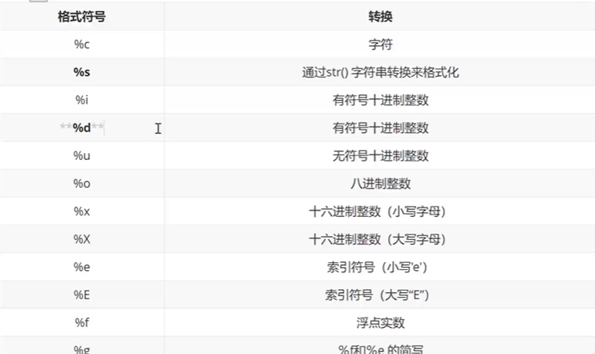

### 输入

#### 输入函数input()

```python
password=input("请输入密码")#input()输入
print("您刚刚输入的密码是",password,sep="")
'''输出
请输入密码bearbearli
您刚刚输入的密码是bearbearli
'''
#score = int(input("请输入成绩"))
```

#### 类型函数type()

```python
# a=10
# print(type(a)) #type()类型
# a="abc"
# print(type(a)) #type()
a=input("输入:")
print(type(a)) #输出<class 'str'>
# print("输入了一个数字:%d"%a)
```

#### 强制类型转换

int()

str()

```python
#强制类型转换
a=input("输入:")
print(type(a)) #输出<class 'str'>
a=int(a) #以上三行a=int(input("输入:"))一步到位
print(type(a)) #输出<class 'int'>
b=11
print(a+b)
'''
输入:2131
<class 'str'>
<class 'int'>
2142
'''
```

## 运算符

### 算术运算符

x\*\*y 返回 x的y次幂(方)

//向下取整除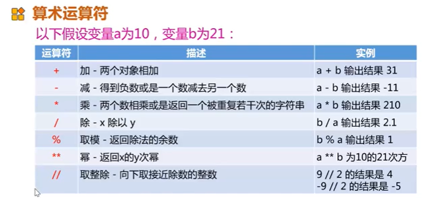

### 比较运算符

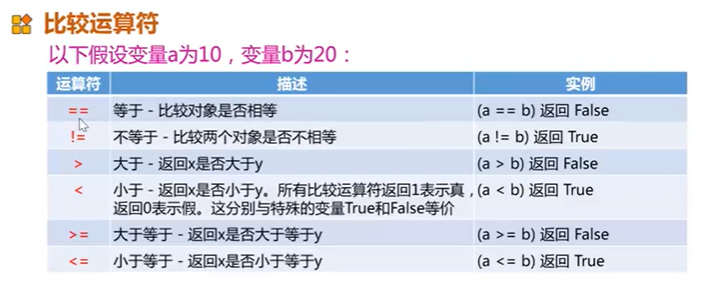

### 位运算符

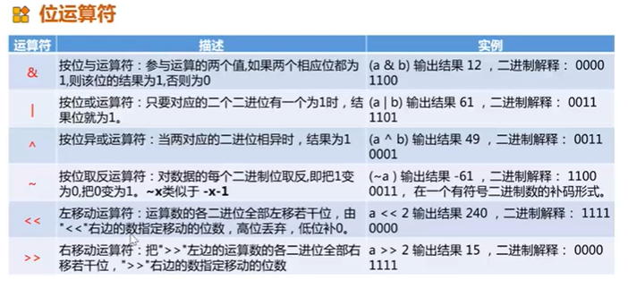

### 逻辑运算符和成员运算符

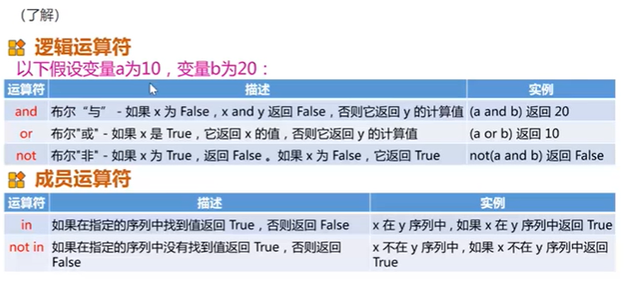

### 运算符的优先级

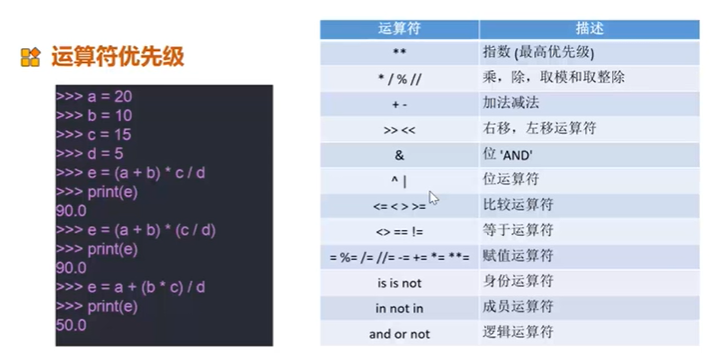

## 判断语句和循环语句

### 判断语句

True:任何非零非空

False：0 None

```python
if True: #1 0 False
    print("True")
    print("False")#相同区域要求缩进一致
elif False:
    print("2")
else:
    print("1")
print("end")#按层次执行，和C语言{}作用有关
```

```python
score = float(input("请输入成绩"))
if score < 60 and score >= 0:
    print("不及格")
elif score < 80 and score >=60:
    print("及格")
elif score == 100 :
    print("满分")
elif score > 100:
    print("超满分，想上天么？")
else:
    print("优秀")
```

```python
#注意缩进！
sex = int(input("输入1代表男生，0代表女生："))
marrage = int(input(("输入1代表单身，0代表有：")))
if sex:
    if marrage:
        print("这位小哥哥，需要我给你介绍女朋友么？")
    else:
        print("呸，渣男！")
else:
    if marrage:
        print("这位小姐姐，需要我给你介绍女朋友么？")
    else:
        print("555...世界上的可爱单身小姐姐又少了一个！")
```

```python
import random   #引入随机库
x = 1
while x != 2:   #这就是while循环，满足条件才执行
    x = random.randint(0, 2)#随机0，1，2
    print(x)
```

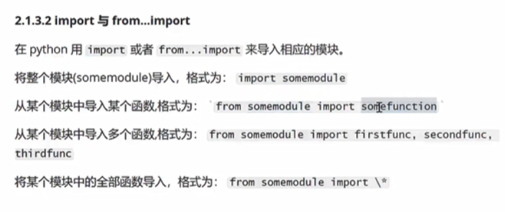

#### 练习：石头剪刀布

```python
import random
tips = ('剪刀（0）', '石头（1）',  '布（2）')
user = eval(input("请输入：剪刀（0），石头（1），布（2）"))
user = int(user)
# eval()函数有妙用
# 如果用user = int(input("请输入：剪刀（0），石头（1），布（2）"))
# 在输入浮点数的情况下会报类型错
# user = random.randint(-1,4) #test
sys = random.randint(0, 2)
if user > 2 or user < 0:
    print("%d?你出了个啥？金箍棒？"%user)
    exit()
print("你的输入为：%s\n系统出的是：%s" % (tips[user], tips[sys]))
if sys - user:
    if sys - user == 1 or sys - user == -2:
        print("哈哈，你输了")
    else:
        print("你赢咯！")
else:
    print("平局！")
```

### 循环语句

#### for循环

有两种，一种是for...in循环

```python
for i in range(5):
    print(i)
# 0
# 1
# 2
# 3
# 4

#从零开始，到11结束(不含11)，步进值为3，即每次+3
for i in range(0,11,3):
    print(i)
# 0
# 3
# 6
# 9

#从-10开始，到-100结束(不含)，步进值为-30，即每次-30
for i in range(-10,-100,-30):
    print(i)
# -10
# -40
# -70

a = ["aa", "bb", "cc", "dd"] #列表
for i in range(len(a)):
    print(i, a[i])
# 0 aa
# 1 bb
# 2 cc
# 3 dd
```

#### while循环

```python
i = 0
while i < 5:
    print(i)
    i += 1
# 0
# 1
# 2
# 3
# 4

#1-100求和
n = 33242521
i = 1
# sum = 0
# while i <= n:
#     sum += i
#     i += 1
# print("sum=%d" % sum)

sum = n*(n + 1)/2
print("sum=%d" % sum)
```

##### while的特殊用法else

```python
count = 0
while count<100:
    print("满足")
    count += 1
else:
    print("bumanzu")
```

#### break continue pass语句

break跳出for while循环

continue跳过当前循环，进行下一循环

pass空语句，一般用作占位语句，不做任何事情

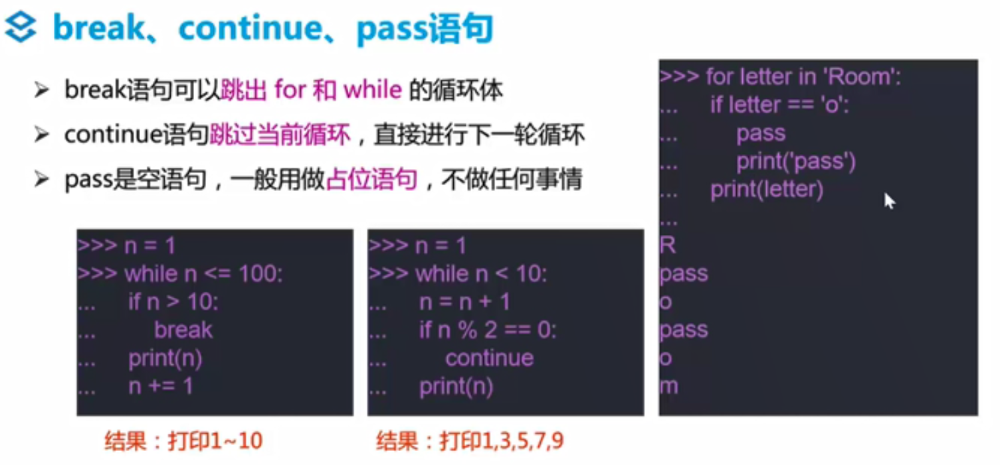

### 练习：九九乘法表

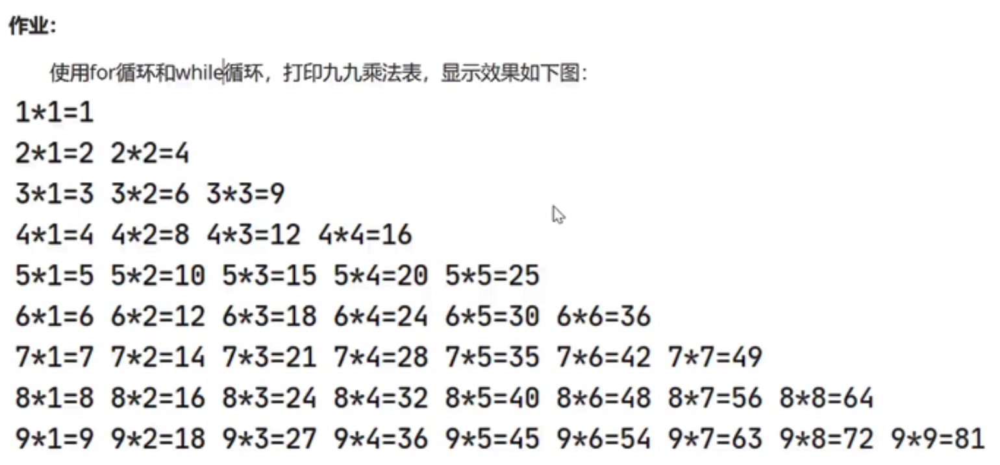

```python
# -*- codeing = utf-8 -*-
# @Time : 2020/12/11 21:57
# @Author : 96bearli
# @File : 九九乘法表.py
# @Software : PyCharm
# 效果：https://gitee.com/bearli/tu/raw/master/img/image-20201211215647597.png

# for循环
for i in range(9):
    for j in range(i + 1):
        print("%d*%d=%d" % (i + 1, j + 1, (i + 1) * (j + 1)), end=" ")#每一个式子的结尾都是一个空格，发现\t会自动对齐
    print(end="\n")#直到换行

# while循环
i = 1
while i <= 9:
    j = 1
    while j <= i:
        print("%d*%d=%d" % (i, j, i * j),end=" ")
        j+=1
    print("")
    i+=1
# 
# 1*1=1 
# 2*1=2 2*2=4 
# 3*1=3 3*2=6 3*3=9 
# 4*1=4 4*2=8 4*3=12 4*4=16 
# 5*1=5 5*2=10 5*3=15 5*4=20 5*5=25 
# 6*1=6 6*2=12 6*3=18 6*4=24 6*5=30 6*6=36 
# 7*1=7 7*2=14 7*3=21 7*4=28 7*5=35 7*6=42 7*7=49 
# 8*1=8 8*2=16 8*3=24 8*4=32 8*5=40 8*6=48 8*7=56 8*8=64 
# 9*1=9 9*2=18 9*3=27 9*4=36 9*5=45 9*6=54 9*7=63 9*8=72 9*9=81 
# 1*1=1 
# 2*1=2 2*2=4 
# 3*1=3 3*2=6 3*3=9 
# 4*1=4 4*2=8 4*3=12 4*4=16 
# 5*1=5 5*2=10 5*3=15 5*4=20 5*5=25 
# 6*1=6 6*2=12 6*3=18 6*4=24 6*5=30 6*6=36 
# 7*1=7 7*2=14 7*3=21 7*4=28 7*5=35 7*6=42 7*7=49 
# 8*1=8 8*2=16 8*3=24 8*4=32 8*5=40 8*6=48 8*7=56 8*8=64 
# 9*1=9 9*2=18 9*3=27 9*4=36 9*5=45 9*6=54 9*7=63 9*8=72 9*9=81 
# 
# Process finished with exit code 0
```

## 字符串 列表 元组 字典

### 字符串（string）

- python里的字符串用**单引号、双引号、三引号**（三个单/双引号）括起来，反斜杠\\转义特殊字符
- 默认utf-8编码，所有字符串都是unicode字符串
- 支持字符串拼接 截取等多种运算

```python
a = '字符串'
b = "这是一个句子"
c = """ 可以保存所有格式
    这是一个段落
"""
print(a, b, c, sep="\n")

nuss = "I'm a boy"
nuss = 'I\'m a boy'  # 加反斜杠转义
nuss = "Tom said \"I'm a boy\""  # 同上
nuss = 'Tom said "I\'m a boy"'  # " ' 混着用
print(nuss)
```

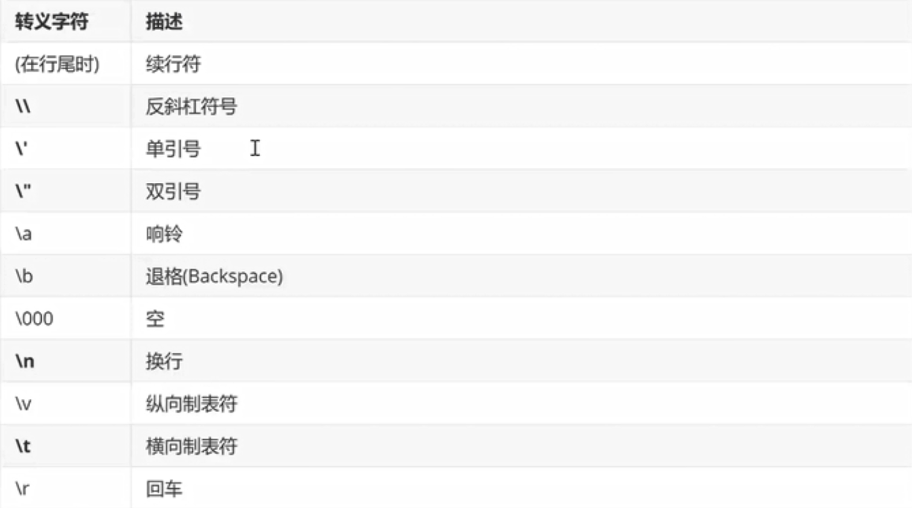

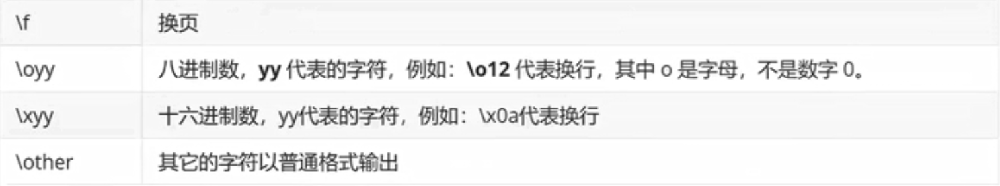

```python
# 字符串
b = "python"
b = "这里是繁荣强大的中国"
print(b)
print(b[0:])
print(b[:5])
print(b[0:3]) #按照下表的方式逐个访问字符[起始位置:结束位置:步进值]
print(b[0:3:2]) #像一个for循环
print(b+"aaa"+"sad") #字符串连接
print(b*3)

# 这里是繁荣强大的中国
# 这里是繁荣强大的中国
# 这里是繁荣
# 这里是
# 这是
# 这里是繁荣强大的中国aaasad
# 这里是繁荣强大的中国这里是繁荣强大的中国这里是繁荣强大的中国
#
# Process finished with exit code 0

print("hello \n python")
print(r"hello \n python")#字符串之前加r表示直接显示原始字符串不进行转义

# hello
#  python
# hello \n python
```

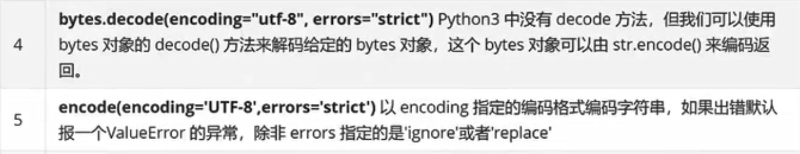

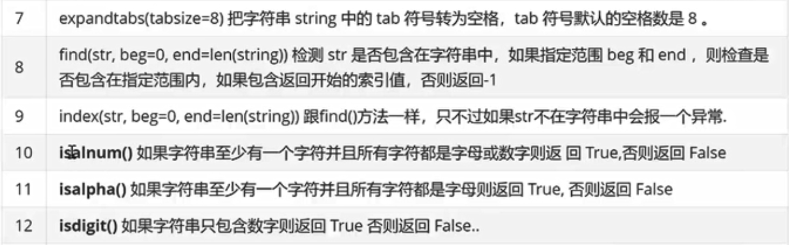

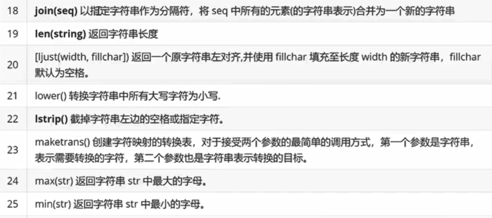

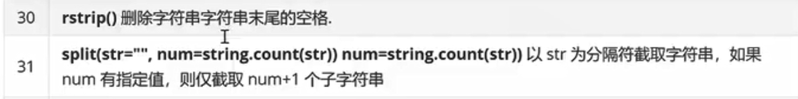

### 列表

- 在\[\]中间，逗号隔开比如list\[“hello”,1\]
- 类型混合，比如整型字符串
- 下标0开始，-1为末尾位置
- +拼接，\*重复

```python
list = []  # 定义一个空列表
list_name = ["小明", "小芳", "小狗"]
list_name = [233, "小芳", "小狗"]
# print(type(list_name[0]))#<class 'int'>
# print(list_name[1])
# print(list_name[2])
```

```python
#遍历的for和while
for name in list_name:
    print(name)

count=len(list_name)
i=0
while i<count:
    print(list_name[i])
    i+=1
```

#### 常用操作

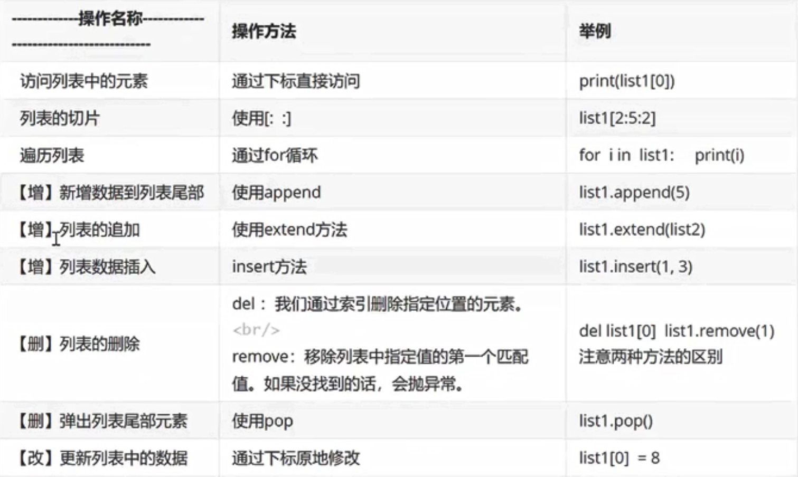

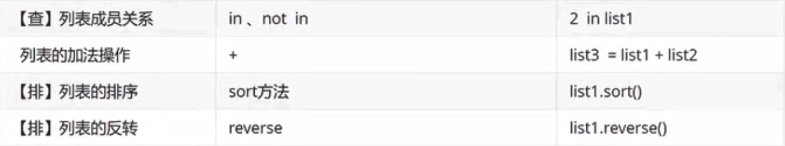

#### 增

```python
#append()在列表末尾追加一个元素
namelist = ["小明", "小芳", "小狗"]
# print("当前列表为%s" % namelist)
# # 当前列表为['小明', '小芳', '小狗']
for name in namelist:
    print(name)
nameadd = input("请输入要增加的姓名：")
namelist.append(nameadd)#在列表末尾追加一个元素
for name in namelist:
    print(name)
```

```python
# extend()把b列表中的每一个元素逐一添加到a
a = [1,2]
b = [3.4]
a.append(b)#把b列表当作一个元素一起添加到a
print(a)
a.extend(b)#把b列表中的每一个元素逐一添加到a
print(a)
# [1, 2, [3.4]]
# [1, 2, [3.4], 3.4]
```

```python
# insert()指定下标位置插入元素
a = ["赵", "钱", "李"]
print(a)
# a.insert(2, "孙")  # (下标,元素)
# print(a)
# ['赵', '钱', '李']
# ['赵', '钱', '孙', '李']
```

#### 删

```python
# 删除
# del删除指定下标位置元素
# pop弹出末尾最后一个元素
# remove直接删除指定内容的元素(找到的第一个)
movieName = ["加勒比","指环王", "泰坦尼克", "速度激情", "指环王", "黑客帝国"]
print("电影名原始list数据为:%s" % movieName)
del movieName[2]  # 删除指定位置元素
print("删除movieName[2]后:%s" % movieName)
movieName.pop()
print("弹出m*Name.pop()后:%s" % movieName)
movieName.remove("指环王")
print("移除指定元素指环王后:%s" % movieName)
# 电影名原始list数据为:['加勒比', '指环王', '泰坦尼克', '速度激情', '指环王', '黑客帝国']
# 删除movieName[2]后:['加勒比', '指环王', '速度激情', '指环王', '黑客帝国']
# 弹出m*Name.pop()后:['加勒比', '指环王', '速度激情', '指环王']
# 移除指定元素指环王后:['加勒比', '速度激情', '指环王']
```

#### 改

```python
# 改指定下标改
movieName = ["加勒比", "指环王", "泰坦尼克", "速度激情", "指环王", "黑客帝国"]
print(movieName)
movieName[1] = "雷神"
print(movieName)
# ['加勒比', '指环王', '泰坦尼克', '速度激情', '指环王', '黑客帝国']
# ['加勒比', '雷神', '泰坦尼克', '速度激情', '指环王', '黑客帝国']
```

#### 查

```python
# 查：[in,not in]
movieName = ["加勒比", "指环王", "泰坦尼克", "速度激情", "指环王", "黑客帝国"]
findName = input("你要找的电影是？")
if findName in movieName:
    print("正在放映中")
else:
    print("即将上映！")
```

#### 其他

```python
# 其他常用函数
# .index() 查找指定下标范围元素，并返回对应数据下标
# 范围区间左闭右开，到3不含三（python中ing常常左闭右开）
# 找不到会报错
movieName = ["加勒比", "指环王", "泰坦尼克", "速度激情", "指环王", "黑客帝国"]
print(movieName.index("泰坦尼克", 0, 3))
print(movieName.index("泰坦尼克"))
print(movieName.index("泰坦尼克", 0, 2))
# 2
```

```python
# list.count(" ")统计某元素出现次数
movieName = ["加勒比", "指环王", "泰坦尼克", "速度激情", "指环王", "黑客帝国"]
print(movieName.count("指环王"))
# 2
```

```python
# 反转，升序，降序
list1 = [1, 5, 2, 4, 3]
print("原来：%s list1" % list1)
# .reverse() 反转
list1.reverse()
print("反转：%s list1.reverse()" % list1)
# .sort() 排序 默认升序
list1.sort()
print("升序：%s list1.sort()" % list1)
list1.sort(reverse=True)
print("降序：%s list1.sort(reverse=True)" % list1)
# 原来：[1, 5, 2, 4, 3] list1
# 反转：[3, 4, 2, 5, 1] list1.reverse()
# 升序：[1, 2, 3, 4, 5] list1.sort()
# 降序：[5, 4, 3, 2, 1] list1.sort(reverse=True)
```

```python
# 嵌套
sss = [['a', 'b', "c"], [1, 2, 3], []]
print(sss[0][1])  # 类似二维数组
for i in sss[0]:
    print(i, end=" ")
sss[1].sort(reverse=1)
print("\n%s" % sss)
sss[2].append("sad")
sss[2].append("happy")
print(sss)
for i in sss:
    print(i)
    if "happy" in i:
        print("happy存在，位置在二维列表sss[%d][%d]" % (sss.index(i), i.index("happy")))
'''
b
a b c 
[['a', 'b', 'c'], [3, 2, 1], []]
[['a', 'b', 'c'], [3, 2, 1], ['sad', 'happy']]
['a', 'b', 'c']
[3, 2, 1]
['sad', 'happy']
happy存在，位置在二维列表sss[2][1]
'''
```

#### 二维列表的小题

八个老师随机分配到三个办公室

```python
# 八个老师随机分配到三个办公室
import random  # 引入random
offices = [[], [], []]
names = ["A", 'B', 'C', 'D', 'E', 'F', 'G', 'H']
for i in names:
    index = random.randint(0, 2)
    offices[index].append(i)  # 随机办公室添加下一个名字
print(offices)
for office in offices:
    if len(office) == 0:
        print("第%d个办公室没分到人" % (offices.index(office) + 1))
        print("--" * 10)
        continue
    print("第%d个办公室的人数为%d,名字分别是：" % (offices.index(office) + 1, len(office)), end="")
    for name in office:
        print(name, end=" ")
    print("")  # 起到换行的作用
    print("--" * 10)
'''
[['D', 'E'], ['A', 'B', 'C', 'F', 'G', 'H'], []]
第1个办公室的人数为2,名字分别是：D E 
--------------------
第2个办公室的人数为6,名字分别是：A B C F G H 
--------------------
第3个办公室没分到人
--------------------
'''
```

#### 列表作业：你到底买不买？

```python
# -*- codeing = utf-8 -*-
# @Time : 2020/12/31 17:59
# @Author : 96bearli
# @File : 作业：你买不买？.py
# @Software : PyCharm

import time

products = [['iphone', 6888], ["MacPro", 14800], ["小米6", 2499], ['Coffee', 31], ['Book', 60], ['Nike', 699]]
shopping_cart = []
numbers = []
choose_list = ['0', '1', '2', '3', '4', '5', 'q']
price = 0
print("下面是商品列表，爱买买，不买滚！")
while True:
    print("-" * 6 + '商品列表' + '-' * 6)
    for product in products:
        print("%d\t%s\t%s" % (products.index(product), product[0], product[1]))
    choose = input("你还买不买啦？输入序号啊！不买按q滚球")
    if choose not in choose_list:
        print("本次输入无效，赫呸，浪费我时间！")
        time.sleep(1)
        continue
    if choose == 'q':
        print("穷逼")
        time.sleep(1)
        break;
    choose = int(eval(choose))
    if products[choose] in shopping_cart:
        numbers[shopping_cart.index(products[choose])] += 1
    else:
        numbers.append(1)
        shopping_cart.append(products[choose])
    price += products[int(choose)][1]
print("-" * 6 + '确认订单' + '-' * 6)
print("好了，下面是你的购物清单：\n")
i = 1
print("序号"+" 商品"+"    单价X数量")
for shopping_thing in shopping_cart:
    print("%d\t%s\t%s X %d" % (i, shopping_thing[0], shopping_thing[1], numbers[shopping_cart.index(shopping_thing)]))
    i += 1
print("\t\t总价格为:%d\n\n我知道你买不起，快滚吧" % price)
'''
------确认订单------
好了，下面是你的购物清单：

序号 商品    单价X数量
1  MacPro 14800 X 3
2  小米6    2499 X 5
3  Coffee 31 X 3
4  iphone 6888 X 1
5  Book   60 X 2
6  Nike   699 X 1
      总价格为:64695

我知道你买不起，快滚吧
'''
```

### 元组

python的核心数据类型

#### tuple(元组)

- tuple(元组)和list类似，不同之处在于tuple的元素不可变，小括号，
    
- 元素逗号隔开
    
- 小括号括起来
    
- 元素不可变，但是可以包含可变对象，如list
    
- **注意**：定义只有**一个元素**的tuple，必须**加逗号**
    
    q:为什么？r:一个括号那是表达式
    
    ```python
    # 为什么一个元素要加逗号
    tup1 = ()
    tup2 = (1) # 这是表达式。。。
    tup3 = (1,)
    print(type(tup1),type(tup2),type(tup3))
    '''
      
    '''
    
    # 元素不可变
    t1 = ("s",)
    t2 = ('a', 'b', ['A', 'B'])  # 'a'不可变，['A','B']内元素可变
    print(t2)
    t2[2][0] = 'X'
    print(t2)
    t2[2][1] = [1, 2, 3]
    print(t2)
    '''
    ('a', 'b', ['A', 'B'])
    ('a', 'b', ['X', 'B'])
    ('a', 'b', ['X', [1, 2, 3]])
    '''
    
    #下标访问和切片 
    tup1 = ("aaa", "bbb", 2020, 2021)
    print(tup1[0])
    print(tup1[-1])
    print(tup1[1:5])  # 含1不含5，左闭右开的切片
    '''
    aaa   
    2021
    ('bbb', 2020, 2021)
    '''
    ```
    
    #### 操作
    

```python
# 增
tup1 = ("aaa", "bbb")
tup2 = (2020, 2021)
tup = tup1 + tup2  # 实际上是两个元组通过连接组合形成新的元组
print(tup)
'''
 ('aaa', 'bbb', 2020, 2021)
'''

# 删
tup1 = ("aaa", "bbb")
print(tup1)
del tup1
print(tup1)  # 删除单个元素不被许可，只能删除整个元组
'''
('aaa', 'bbb')
error:tup1 not define
'''

# 改
# 除了改元组里的列表list里的元素，其他的改不了

# 查
tup1 = ("aaa", "bbb")
tup2 = (2020, 2021)
tup = tup1 + tup2
# if x in x:
if tup1 in tup:  # 这句话的定义其实是在("aaa", "bbb"，2020, 2021)中寻找("aaa","bbb")
    print('tup1 exist in tup')  # 即(("aaa","bbb"), "bbb"，2020, 2021)才能查找成功
if tup2 in tup:
    print('tup2 exist in tup')
if 'aaa' in tup:
    print('\'aaa\' exist in tup')
if 2020 in tup:
    print('2020 exist in tup')
'''
'aaa' exist in tup
2020 exist in tup
'''

# .count
print("2020数量为：", tup1.count(2020))  # 想用""+tup1.count(2020)的形式报错
# len()
print("元组长度为：", len(tup))
# max() min()
print("元组中最大值为：", max(tup2), "元组中最小值为：", min(tup2))
# 其他类型转元组
list1 = [1, 2, 3, 4, 5]
print(list1)
print(tuple(list1))
'''
2020数量为： 0
元组长度为： 4
元组中最大值为： 2021 元组中最小值为： 2020
[1, 2, 3, 4, 5]
(1, 2, 3, 4, 5)
'''
```

### 字典

python的核心数据类型

#### dict(字典)

- 字典是无序的对象集合，使用键-值(key-value)存储，具有极快的查找速度
    
- 键(key)必须使用不可变类型
    
- 同一字典中键(key)必须唯一
    
- 为了查一个键快速找到它的值
    
    ```python
    # 字典的定义
    info = {"name": "luck", "age": 18}
    # dict的访问
    print(info["name"])
    print(info["age"])
    # 访问不存在的键
    # print(info["age1"])  # 为了直接访问避免报错，提供一个默认值
    print(info.get("age1"))  # 使用get方法，没有找到对应的键，默认返回None
    print(info.get("age1", "sss"))  # 修改默认值为sss
    '''
    luck
    18
    None
    sss
    '''
    ```
    

#### 增删改查

```python
# 增
info = {"name": "luck", "age": 18}
newid = input("输入学号")
info["id"] = newid
# print(info.get("id", '增加失败'))
print(info)
'''
输入学号12
12
{'name': 'luck', 'age': 18, 'id': '12'}
'''

# 删
# del clear
# [del] 
info = {"name": "luck", "age": 18}
print("删除前：%s" % info["name"])
del info["name"]  # 删除整个键值对
print("删除后：%s" % info.get("name", "未找到"))
'''
删除前：luck
删除后：未找到
'''
info = {"name": "luck", "age": 18}
print("删除前：%s" % info)
del info #删除整个字典
print("删除后：%s" % info)
'''
删除前：{'name': 'luck', 'age': 18}
error
'''

# [clear] 清空
info = {"name": "luck", "age": 18}
print("删除前：%s" % info)
info.clear()  # 感觉和重新定义info={}效果一样
print("删除后：%s" % info)
'''
删除前：{'name': 'luck', 'age': 18}
删除后：{}
'''
# 改
info = {"name": "luck", "age": 18}
print(info)
info["age"]=19
print(info)
'''
{'name': 'luck', 'age': 18}
{'name': 'luck', 'age': 19}
'''

# 查
# 键的查询和值的查询
info = {"name": "luck", "age": 18}
# 得到所有的键 .keys()
print(info.keys())
print(type(info.keys()))  # 列表的形式
print(list(info.keys()))  # 转化为列表
keys=list(info.keys())
for key in keys:
    print(key)
"""
dict_keys(['name', 'age'])
<class 'dict_keys'>
['name', 'age']
name
age
"""
# 得到所有的值 .values()
print(info.values())  # 列表
# 得到所有的项 .items()
print(info.items())  # 可以作为元组

# 遍历
for key in info.keys():
    print(key,end='\t')
print("")
for value in info.values():
    print(value,end='\t')
'''
name    age 
luck    18  
'''
# 遍历键值对
print(info.items())
for key, value in info.items():  # for循环两个值
    # print(key, value, sep="\t", end='\n')
    print("%4s:%4s"%(key, value))
'''
dict_items([('name', 'luck'), ('age', 18)])
name:luck
 age:  18
'''

Products = {'iphone': 6888, "MacPro": 14800, "小米6": 2499, 'Coffee': 31, 'Book': 60, 'Nike': 699}
TheNumber = 0
for i, x in Products.items():
    print("%d\t%s\t%s" % (TheNumber, i, x))
    TheNumber += 1
print(list(enumerate(Products)))
'''
0   iphone  6888
1   MacPro  14800
2   小米6    2499
3   Coffee  31
4   Book    60
5   Nike    699
[(0, 'iphone'), (1, 'MacPro'), (2, '小米6'), (3, 'Coffee'), (4, 'Book'), (5, 'Nike')]

Process finished with exit code 0
'''
```

#### dict操作和其他的一些操作汇总

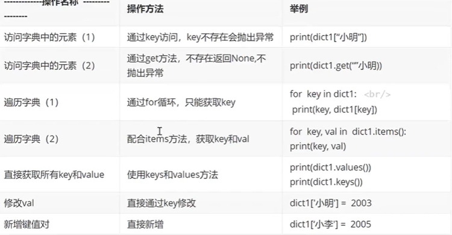

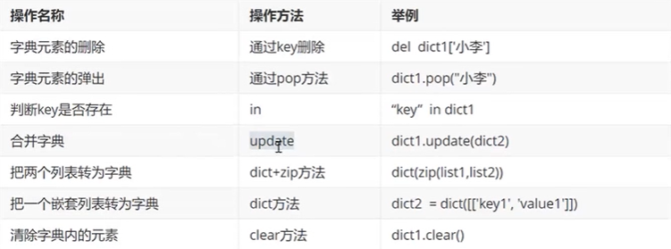

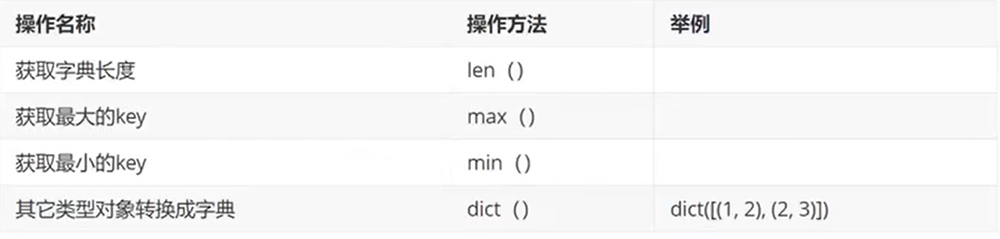

### 集合

#### set(集合)

- 类似dict,不储存value,是一组key的集合,用大括号括起来,因为key不能重复,所以set中的元素也不会重复
- set是无序的,重复元素再setzhongbeizidongguolv
- 常用来去重,再转化为需要类型

```python
# set的定义类似于强制类型转化
listOne = [1, 2, 3, 4, 'a', 1, 2]
set1One = set(listOne)
print(set1One)  # 输出体现了去重的特性
'''
{1, 2, 3, 4, 'a'}
'''
listTwo = list(set1One)
print(listTwo)  # 得到了去重后的listOne
'''
[1, 2, 3, 4, 'a']
'''
```

#### 常用操作

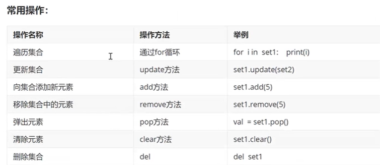

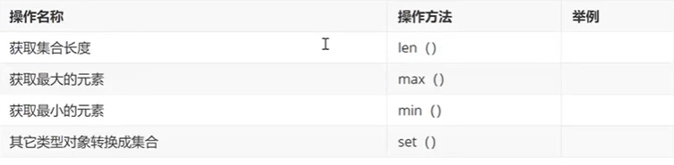

### 小结

| 类型 | 是否有序 | 是否可变类型 |
| --- | --- | --- |
| 列表list \[\] | 有序 | 可变 |
| 元组tuple () | 有序 | 不可变 |
| 字典dict {} | 无序 | key不可变不可重,value可变 |
| 集合set {} | 无序 | 可变不可重 |

## 函数

### 函数的概念

代码集合成块方便被多次调用

### 函数的定义

```python
# 函数的定义,放在使用前,import以下
def printinfo():
    print("--" * 10)
    print("  现在是过去最好的结果")
    print("--" * 10)

# 函数的调用
printinfo()
```

### 常用技巧

```python
# 带参数的和带返回值的
def add2Num(a, b):
    return a+b

print(add2Num(11, 22))
'''
33
'''
```

### 习题

```python
# 函数-课堂练习
# 1.打印一条横线
# 2.通过参数打印自定义行数的横线
# 3.写一个函数求三个数之和
# 4.写一个函数求三个数的平均值

# 1.2.
def line():
    print("-" * 20)

def nxLine(n):
    for i in range(int(n)):  # 如果不进行整型处理,返回n为str的错误
        line()
    print("横线打印完成,总共%d行"%(i+1))

num = input("请输入要打印横线的行数:")
nxLine(num)
'''
请输入要打印横线的行数:3
--------------------
--------------------
--------------------
横线打印完成,总共3行

Process finished with exit code 0
'''

# 3.4.
def threeNumSum(a, b, c):
    return a + b + c

def threeNumAverage(a, b, c):
    return threeNumSum(a, b, c) / 3

a, b, c = map(float, input("请输入3个数字,空格分隔").split())
print("三数之和为%.2f,均值为%.2f" % (threeNumSum(a, b, c), threeNumAverage(a, b, c)))
'''
请输入3个数字,空格分隔1.45 1.22 54.22
三数之和为56,均值为18.96
'''
# 两个知识点
# 1.%f浮点型,%5.2f意思是共5个位置,小数点后保留2位
# 2.map(float, input("请输入3个数字,空格分隔").split())
#   由于input( )输出的是用空格分开的字符串
#   split( )会分割开各个值并放到列表中，此时在列表中的值是字符串
#   如果要用于运算必须在map( )中利用int( )或者float( )等处理
#   再赋值。如果需要赋值的值都是字符串的话就没必要用map函数了。
#   input('输入a,b空格隔开:').split()即可
```

```python
# 全局变量和局部变量
def test1():
    a= 100
    print(a)
    a = 200
    print(a)

a = 1 # 全局变量和局部变量名字相同,优先使用局部
test1()
print(a)
'''
100
200
1
'''
# 一般情况下函数内部不能修改全局变量
a = 111

def test2():
    print(a)
    # a = 200 #发现函数内部不能修改全局变量,同时使用会报错
    print(a)

a = 11
test2()
print(a)
'''
11
11
11
'''

# global
def test2():
    global a  # global声明使用全局变量
    print(a)
    a = 200
    print(a)

a = 11
test2()
print(a)  # 可以看到这里的a已经在函数中被修改
'''
11
200
200
'''
```

## 文件操作

储存数据

### 访问模式

| type | info |
| --- | --- |
| r | 以只读方式打开文件。文件的指针将会放在文件的开头。这是默认模式。 |
| w | 打开一个文件只用于写入。如果该文件已存在则将其覆盖。如果该文件不存在，创建新文件。 |
| a | 打开一个文件用于追加。如果该文件已存在，文件指针将会放在文件的结尾。也就是说，新的内容将会被写入到已有内容之后。如果该文件不存在，创建新文件进行写入。 |
| rb | 以二进制格式打开一个文件用于只读。文件指针将会放在文件的开头。这是默认模式。 |
| wb | 以二进制格式打开一个文件只用于写入。如果该文件已存在则将其覆盖。如果该文件不存在，创建新文件。 |
| ab | 以二进制格式打开一个文件用于追加。如果该文件已存在，文件指针将会放在文件的结尾。也就是说，新的内容将会被写入到已有内容之后。如果该文件不存在，创建新文件进行写入。 |
| r+ | 打开一个文件用于读写。文件指针将会放在文件的开头。 |
| w+ | 打开一个文件用于读写。如果该文件已存在则将其覆盖。如果该文件不存在，创建新文件。 |
| a+ | 打开一个文件用于读写。如果该文件已存在，文件指针将会放在文件的结尾。文件打开时会是追加模式。如果该文件不存在，创建新文件用于读写。 |
| rb+ | 以二进制格式打开一个文件用于读写。文件指针将会放在文件的开头。 |
| wb+ | 以二进制格式打开一个文件用于读写。如果该文件已存在则将其覆盖。如果该文件不存在，创建新文件。 |
| ab+ | 以二进制格式打开一个文件用于追加。如果该文件已存在，文件指针将会放在文件的结尾。如果该文件不存在，创建新文件用于读写。 |

### 文件的打开关闭写入读取

```python
# 文件的打开与关闭
# mm = "test.txt"
# f = open(mm, "a")  # 在当前路径下，写入模式w可以自动新建
# f.write("\ntest")
# f.close()  # 关闭

# 文件的读
# ss = open("test.txt", "r")
# print(ss.read(2))  # 空格也算一个字符
# print(ss.read(2))  # 指针也在不断后移
# ss.close()
'''
t
es
'''
f = open("test.txt", "r")
text1 = f.readlines()  # 一次性读取全部信息作为列表,一行一元素
i = 1
for text in text1:
    print("line", i, ':', text, sep="", end="")
    i += 1
f.close()
'''
line1:testtesttest
line2:test
line3:test
line4:test
line5:test
line6:test
line7:test
Process finished with exit code 0
'''

f = open("test.txt", "r")
text1 = f.readline()  # 一次读一行,每次指针下移一行,参数限制每次字符个数
print(text1)
text1 = f.readline()
print(text1)
f.close()
"""
test--1

test--2
"""
```

### 文件的相关操作

#### os模块

```python
# os模块:重命名.删除等
import os
# 重命名
os.rename("test.txt", "尝试.txt")
# 删除
os.remove("尝试.txt")
# 创建文件夹
os.mkdir("cache")
# 获取当前路径
os.getcwd()
# 改变默认目录
os.chdir("../") # 应该是指上一层
# 获取目录列表
os.listdir('./') # 指当前目录
# 删除文件夹
os.rmdir("cache")
```

## 错误和异常

处理可以预料到的错误,避免一处可以避免的错误造成程序崩溃(终止)

### 演示

```python
# 错误和异常
print("--------1---")  # mark
f = open("123.txt","r")
print("--------2---")
'''
--------1---
Traceback (most recent call last):
  File "C:/Users/Administrator/OneDrive/doc/code/python/demo/12.错误和异常.py", line 9, in <module>
    f = open("123.txt""r")
FileNotFoundError: [Errno 2] No such file or directory: '123.txtr'

Process finished with exit code 1
'''

# 捕获异常
try:
    print("--------1---")  # mark
    f = open("123.txt","r")
    print("--------2---")
except IOError: # 文件未找到属于输入输出异常，即IO异常
    pass
'''
--------1---
'''

# 异常类型
try:
    print(num)  # mark
except NameError:  # 必须要对应的异常才能捕获到,这里如果是IOError依然会报错
    print("num未定义")
'''
num未定义
'''

# 把可能产生的所有异常类型都放在小括号中
try:
    print("--------1---")  # mark
    f = open("123.txt","r")  # 由输出可以看到运行到这里已经停止了
    print("--------2---")
    print(num)
except (IOError, NameError):  # 这个小括号
    print("error")
"""
--------1---
error
"""

# 到底是哪种错误？获取错误信息描述
try:
    print("--------1---")
    f = open("123.txt","r")
    print("--------2---")
    print(num)
except (IOError, NameError) as result:  # as 自定义变量名 储存错误信息
    print("error")
    print(result)
'''
error
[Errno 2] No such file or directory: '123.txt'
'''

# personal test
def openfile():
    print("--------1---")
    f = open("123.txt", "r")
    print(f.readline())
    print("--------2---")
    f.close()

try:
    openfile()
except Exception as result:
    print(result)
    f = open("123.txt", "w")
    f.write("异常已修复")  # 发现输入中文会出现编码错误，应该输入英文或者改变编码utf-8
    f.close()
    openfile()
'''
两次运行
1：报错并修复
--------1---
[Errno 2] No such file or directory: '123.txt'
--------1---
异常已修复
--------2---
2：运行成功
--------1---
异常已修复
--------2---
'''

# try except的嵌套和finally的使用
import time

try:
    f = open("test.txt", "r")
    try:
        while True:
            lineContent = f.readline()
            if len(lineContent) == 0:
                break
            print(lineContent, end="")
            time.sleep(0.3)
    finally:
        f.close()
        print("\n文件关闭")
except Exception as result:
    print(result)
'''
# 存在.txt
test--1
test--2
test--3
test--4
test--5
test--6
test--7
文件关闭
# 不存在.txt
[Errno 2] No such file or directory: 'test111.txt'
'''
```

### 作业:写的诗抄的快

```python
'''
作业内容
1.第一个函数 写入一首诗(我就不写诗)到guyu.txt
2.另一个函数的作用是读取guyu.txt,并写入copy.txt,控制台输出"复制完毕"
'''

def guYuTxt():
    print("开始写入古诗")
    try:
        f = open("guyu.txt", "r")
        f.close()
        choise = input("当前目录已存在guyu.txt,是否覆盖?Y/n")
        if choise == "Y" or choise == "y":  # 出现错误:if choise == "Y" or "y"
            f = open("guyu.txt", "w", encoding='utf-8')  # 要注意,不改变编码方式中文乱码
        else:
            print("程序退出")
            exit()
    except Exception:
        f = open("guyu.txt", "w", encoding='utf-8')
    f.write("或问:放心如何收?\n余曰:只君此问便是收了\n这收放甚容易\n才昏昏便出去\n才惺惺便在此")
    f.close()

def copyGuYu():
    print("开始复制")
    try:
        try:
            f = open("guyu.txt", "r", encoding="utf-8")
            guYus = f.readlines()
        except Exception as result:
            print(result, "\nguyu.txt不存在,程序退出")
            exit()
        finally:
            f.close()
    except Exception:
        print("guyu.txt读取出现问题")
        exit()
    print("成功复制,准备写入copy.txt")
    try:
        f = open("copy.txt", "r", encoding="utf-8")
        f.close()
        choise = input("当前目录已存在copy.txt,是否覆盖?Y/n")
        if choise == "Y" or choise == "y":
            f = open("copy.txt", "w", encoding='utf-8')
        else:
            print("程序退出")
            exit()
    except Exception as result2:
        f = open("copy.txt", "w", encoding='utf-8')
    for guYu in guYus:
        f.write(guYu)
    f.close()
    print("复制完毕")

guYuTxt()
copyGuYu()
```

# python爬虫

任务驱动式

## 任务介绍

爬取[豆瓣电影Top250](https://movie.douban.com/top250)的基本信息

包括:

**电影名称** **豆瓣评分** **评价数** **电影概况** **电影链接** 等等


## 爬虫初识

- 按一定规则自动把网上的东西扒下来
- 本质上是模拟浏览器打开网页
- 百度指数可以查看关键词搜索人数index.baidu.com

## 基本流程

### 准备工作

观察目标网站 分析目标网页

#### url

观察下一页和前一页的差别 得知movie.douban.com/top250?start=\*\*\*

\*\*\*为该页面开始的元素，每页25个元素，即要获取226-250为?/start=225

#### 页面元素

借助dev工具Element 获取元素标签路径

```python
'''
BeautifulSoup4 将复杂HTML文档转换成一个复杂的树形结构
每 个节点都是Python对象
所有对象可以归纳为4种：
tag，NavigableString，BeautifulSoup，Comment。
'''

# 使用目录下baidu.html演示

'''基础：
# 1.标签及内容 
# print(bs.title)
# < title > 百度一下，你就知道 < / title >

# 2.标签的内容 .string
print(bs.title.string)
# 百度一下，你就知道

# 3.打印属性 .attrs
print(bs.a.attrs)
# {'class': ['mnav'], 'href': 'http://news.baidu.com', 'name': 'tj_trnews'}

# 4.comment 特殊的NavigableString，不包含注释符号
print(bs.a.string)
print(type(bs.a.string))
# <class 'bs4.element.Comment'>
'''

"""
from bs4 import BeautifulSoup

try:
    with open("./baidu.html", "rb") as file:  # 2进制读取
        html = file.read()
        bs = BeautifulSoup(html, "html.parser")  # (解析对象，解析器)
        # # bs是一个树形结构 根枝叶
        # print(bs.title)
        # # < title > 百度一下，你就知道 < / title >
        # print(bs.a)
        # # < a class ="mnav" href="http://news.baidu.com" name="tj_trnews" > < !--新闻--> < / a >
        # print(bs.head)
        # # html的line3-line9
        # print(bs.body)
        # # 这个形式是输出tag，找到第一个出现的标签以及标签内所有内容
        # print(type(bs.body))
        # # 输出<class 'bs4.element.Tag'>

        # print(bs.title.string)
        # # 百度一下，你就知道
        # print(bs.a.string)
        # # 新闻
        # print(type(bs.a.string))
        # # <class 'bs4.element.Comment'>

        # print(bs.a.attrs)
        # # {'class': ['mnav'], 'href': 'http://news.baidu.com', 'name': 'tj_trnews'}
        # print(bs.title.attrs)

        # print(bs.head.link.attrs)
        # # {'href': 'https://ss1.bdstatic.com/5eN1bjq8AAUYm2zgoY3K/r/www/cache/bdorz/baidu.min.css', 'rel': ['stylesheet'],'type': 'text/css'}

        print(bs.a.string)
        print(type(bs.a.string))
        print(type(bs.title.string))
        # 新闻
        # <class 'bs4.element.Comment'>
        # <class 'bs4.element.NavigableString'>
        print(bs.a)
        print(bs.a.next_sibling.next_sibling)  # 第二个<a
        # < a class ="mnav" href="http://news.baidu.com" name="tj_trnews" > < !--新闻--> < / a >
        # < a class ="mnav" href="http://news.baidu.com" name="tj_trnews" > 新闻 < / a >

except Exception as error:
    print(error)
"""

'''应用-有针对性的扒东西 https://blog.csdn.net/xiaoyu_wu/article/details/102295184
# 文档的遍历
print(bs.head.contents[1]) # .contents得到本标签的列表,既然是列表就可以直接读取了
#<meta content="text/html;charset=utf-8" http-equiv="content-type"/>

# *文档的搜索
# 搜索
# 1.find_all()
# 字符串过滤：会查找与字符串完全匹配的内容
a_list = bs.find_all("a")  # 查找所有名字叫”meta“的节点放到一个列表里
for a in a_list:
print(a)

# 2.正则表达式搜索
# 使用search()方法来匹配内容
# 需要引入re模块
import re
a_list = bs.find_all(re.compile("a"))  # 含有"a"的标签的所有内容比如<head>输出到</head>

# 3.方法：传入一个函数(方法)，根据函数的方法来引入,很强大
    def name_is_exists(tag):
        return tag.has_attr("class") # 键
    a_list = bs.find_all(name_is_exists)
    for a in a_list:
        print(a)   

# 4.kwargs 参数
# a_list = bs.find_all(id="head") # id name class_
# a_list = bs.find_all(class_=True)
a_list = bs.find_all(href = 'http://news.baidu.com')
for a in a_list:
    print(a.string)
'''
```

```python
from bs4 import BeautifulSoup

try:
    with open("./baidu.html", "rb") as file:  # 2进制读取
        bs = BeautifulSoup(file.read(), "html.parser")
        # print(bs)
        # print(bs.head.contents)  # 得到本标签的列表
        # # ['\n', <meta content="text/html;charset=utf-8" http-equiv="content-type"/>, '\n', <meta content="IE=Edge" http-equiv="X-UA-Compatible"/>, '\n', <meta content="always" name="referrer"/>, '\n', <link href="https://ss1.bdstatic.com/5eN1bjq8AAUYm2zgoY3K/r/www/cache/bdorz/baidu.min.css" rel="stylesheet" type="text/css"/>, '\n', <title>百度一下，你就知道 </title>, '\n']
        # print(bs.head.contents[1])  # 既然是列表就可以直接读取了
        # # <meta content="text/html;charset=utf-8" http-equiv="content-type"/>
        # print(bs.body.contents)

        # 搜索 https://www.cnblogs.com/changwoo/p/9932085.html
        # # 1.find_all()
        # a_list = bs.find_all("a")  # 查找所有名字叫”meta“的节点放到一个列表里
        # for a in a_list:
        #     print(a)

        # 2.正则表达式搜索
        # 使用search()方法来匹配内容
        # 需要引入re模块
        # import re
        # a_list = bs.find_all(re.compile("a"))  # 含有"a"的标签的所有内容比如<head>输出到</head>
        # for a in a_list:
        #     print(a)

        # 3.方法：传入一个函数(方法)，根据函数的方法来引入,很强大
        # def name_is_exists(tag):
        #     return tag.has_attr("class") # 键
        # a_list = bs.find_all(name_is_exists)
        # for a in a_list:
        #     print(a)

        # 4.kwargs 参数
        # a_list = bs.find_all(id="head") # id name class_
        # a_list = bs.find_all(class_=True)
        # a_list = bs.find_all(href = 'http://news.baidu.com')
        # for a in a_list:
        #     print(a.string)

        # 5.text 文本参数
        # a_list = bs.find_all(text=['hao123', '地图', '贴吧'])
        # for a in a_list:
        #     print(a.string)
        '''
            这特喵有啥用？判断有没有？
            hao123
            地图
            贴吧'''
        # import re
        # # 6.用正则表达式来查找包含特定文本的内容，标签里的字符串
        # a_list = bs.find_all(text=re.compile("\d")) # 数字
        # for a in a_list:
        #     print(a.string)

        # 7.limit参数
        # a_list = bs.find_all("a", limit=3)  # 就要前三个
        # for a in a_list:
        #     print(a.string)

        # 8.css选择器.select()
        # #指定标签
        # print(bs.select('title')[0].string)
        # #百度一下，你就知道
        # #指定类名来查找 此处为class='mnav'
        # print(bs.select('.mnav'))
        # #指定id来查找
        # print(bs.select('#u1'))
        # #指定属性来查找
        # print(bs.select("[class='bri']"))
        # print(bs.select('a[href="//www.baidu.com/more/"]')[0].string)
        # [ < a class ="bri" href="//www.baidu.com/more/" name="tj_briicon" style="display: block;" > 更多产品 < / a >]
        # 更多产品

        # # 按子标签查找
        # print(bs.select("body > div > div > div > div > a"))

        # # 按照兄弟节点查找特定标签 '.'代表class
        print(bs.select(".mnav ~ .bri")[0].get_text())
        # 更多产品
except Exception:
    pass
```

#### 服务器响应

借助dev工具network

##### Headers

UA（User-Agent）操作系统 浏览器 架构等信息

cookie 标识客户端，包含登录访问ip地理位置等各种信息

Accept 可以接受的数据 等

##### Response

服务器返回的数据

应用的模块urllib.requst

```python
# UA伪装(例子：伪装真实访问并获取网页源码)
import urllib.request

url = "http://www.httpbin.org/post"
# data的构建形式
data = bytes(urllib.parse.urlencode({"hi": "this is a test"}), encoding="utf-8")  # 转为2进制
# headers字典内可以构建完全的浏览器信息键值对（可以在devTool获取）
headers = {
    "User-Agent": "Mozilla/5.0 (Windows NT 10.0; Win64; x64) AppleWebKit/537.36 (KHTML, like Gecko) Chrome/87.0.4280.88 Safari/537.36 Edg/87.0.664.66"
}
# req是用Request类构建的请求 默认get方式
req = urllib.request.Request(url=url, data=data, headers=headers, method="POST")
# 用urlopen对网站发起请求req
response = urllib.request.urlopen(req)
print(response.read().decode("utf-8"))

#  应用
import urllib.request

url = "https://movie.douban.com/top250?start=0"
headers = {
    "User-Agent": "Mozilla/5.0 (Windows NT 10.0; Win64; x64) AppleWebKit/537.36 (KHTML, like Gecko) Chrome/87.0.4280.88 Safari/537.36 Edg/87.0.664.66"
}
req = urllib.request.Request(url=url, headers=headers)
response = urllib.request.urlopen(req)
print(response.read().decode("utf-8"))
```

#### 编码规范

一般python第一行需要加入两者之一，可以解决中文的编码问题

```python
# coding=utf-8
# -*- coding:utf-8 -*-
```

多用函数

加入main函数用于测试程序(看演示)

```python
if _name_ == "_main_":
        main()
```

添加必要的注释便于理解

#### 代码演示

演示内容包括main函数 引入模块

```
# 安装模块(cmd/shell)
pip install package
```

```python
from bs4 import BeautifulSoup  # 网页解析获取数据
import re # 正则表达式,文字匹配
import urllib.request, urllib.error  # 指定url获取网页数据
import xlwt  # 进行excel操作
import sqlite3  # sqlite数据库操作

from test1 import t1  # 引入模块，其中test1表示文件夹(package)，文件t1.py

print(t1.add(23, 22))
'''
45 #成功引入t1并使用其中add函数
'''

def main():
    print("sad")

if __name__ == "__main__":  # 意思就是当程序执行时，为了更清楚的看主流程
    main()  # 调用函数 就是个程序入口
```

### 获取数据

通过http库发起请求，请求可以包括额外的header等内容如果服务器正常响应，会得到一个Response，这就是要的页面内容

### 解析内容

用**页面解析库，正则表达式**解析得到的html，json格式内容

### 保存数据

可以保存为文本，可以保存到数据库，或者特定格式的文件

### 补充

#### 正则表达式

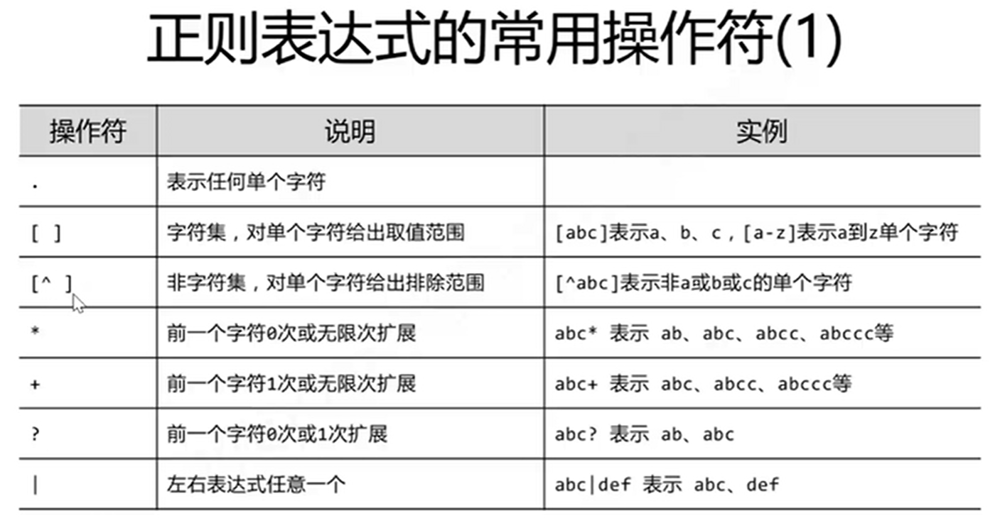

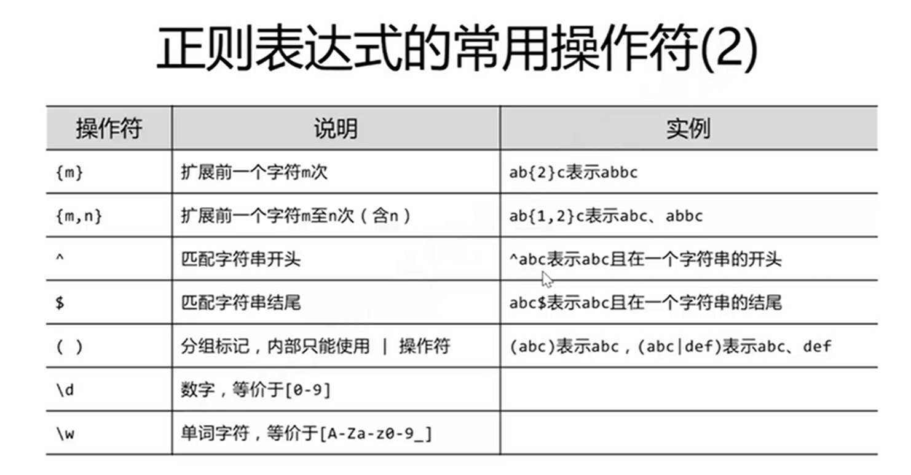

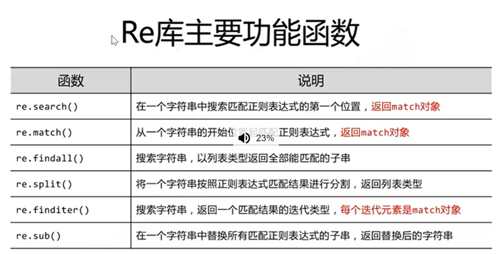

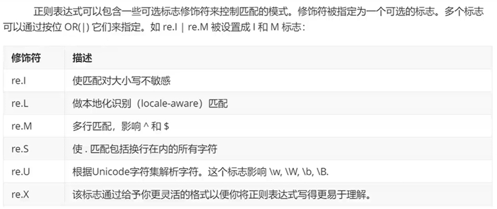
