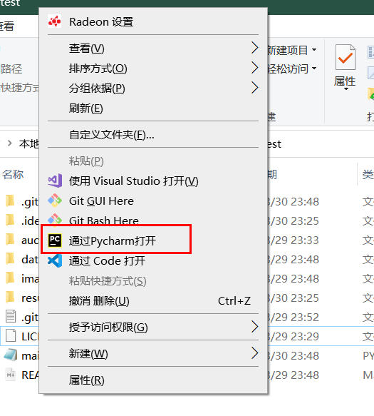
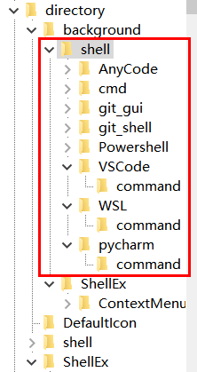
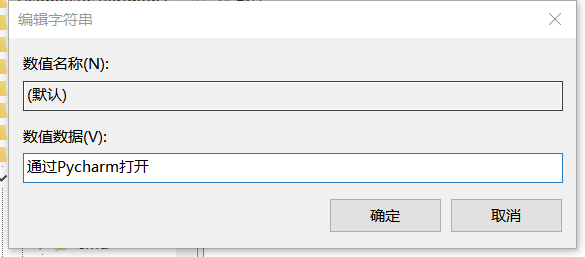
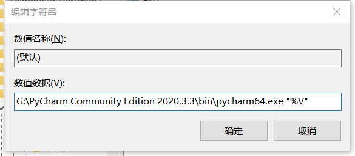
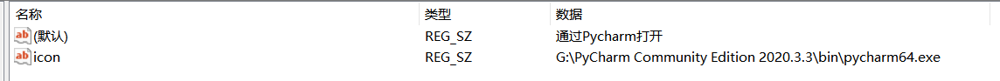

图中这个选项的增加，删除同理。直接上流程



## 流程

1. win + R 输入 regedit 回车打开注册表编辑器
    
2. 进入此路径
    
    ```
    计算机\HKEY_CLASSES_ROOT\directory\background\shell
    ```
    
    
    
3. shell下新建项，名为pycharm
    
    pycharm下有个默认值，右键修改，数值数据改为“通过Pycharm打开”
    
    
    
4. pycharm下新建项，名为command
    
    command下有个默认值，右键修改，数值数据改为pycharm64.exe的**绝对路径**\+ **"%V"**
    
    （右键pycharm的快捷方式，点击属性查看路径
    
    
    
5. 可选：为“通过Pycharm打开”前增加图标
    
    pycharm下右键新建->字符串值，名称：icon，数值数据改为pycharm64.exe的**绝对路径**
    


